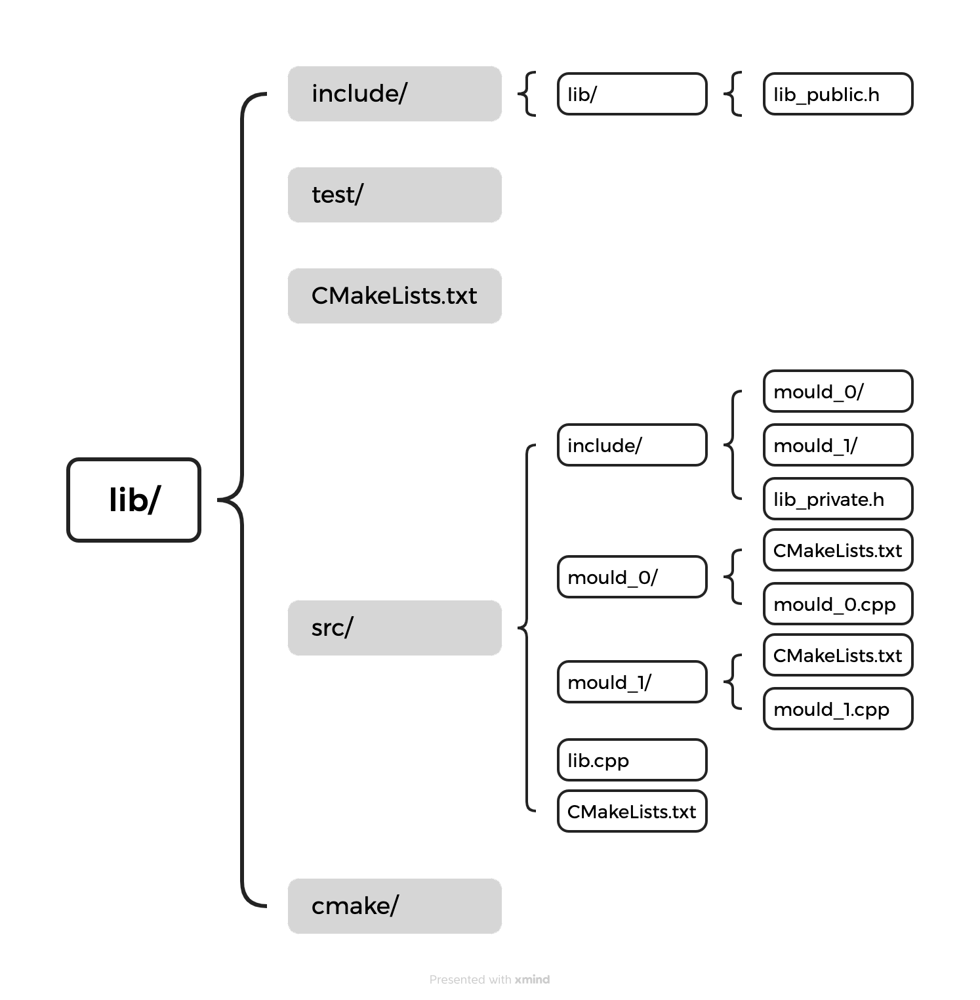

# My Cmake Lib Template

This is my template for creating a C++ library.

I'm satisfied with the current structure, but I'm not sure if it's the best way to do it.

## Structure

```tree
.
├── CMakeLists.txt
├── cmake
│   └── my_math-config.cmake.in
├── include
│   └── my_math
│       └── my_math.h
├── readme.md
├── src
│   ├── CMakeLists.txt
│   ├── include
│   │   ├── my_add
│   │   │   └── my_add.h
│   │   └── my_sub
│   │       └── my_sub.h
│   ├── my_add
│   │   ├── CMakeLists.txt
│   │   └── my_add.cpp
│   ├── my_math.cpp
│   └── my_sub
│       ├── CMakeLists.txt
│       └── my_sub.cpp
└── test
    ├── CMakeLists.txt
    └── test.cpp
```

It is based on the following figure.



Here is a brief explanation of each directory.

- `include`: Header files that are exposed to the user.
- `src`: Source files that are not exposed to the user.
- `test`: Test files.
- `cmake`: Includes macros and functions, find_modules, and one-off scripts.

## Usage

### Build

```bash
$ cd $LIB_DIR
$ cmake -B build
$ cmake --build build -t install
```

It will be installed in `install` dir in the current dir. 


### Use this library

Firstly, create a simple project.

```bash
$ mkdir $YOUR_PROJECT
$ cd $YOUR_PROJECT
$ touch main.cpp
$ touch CMakeLists.txt
```

Then, write the following in `CMakeLists.txt`.

```cmake
cmake_minimum_required(VERSION 3.20)

project(YOUR_PROJECT VERSION 0.0.0 LANGUAGES CXX)

add_executable(${PROJECT_NAME} main.cpp)

set(CMAKE_PREFIX_PATH "$LIB_DIR/install/lib/cmake")

find_package(my_math REQUIRED)

if(my_math_FOUND)
  message(STATUS "my_math found")
else()
  message(STATUS "my_math not found")
endif()

target_link_libraries(${PROJECT_NAME} PRIVATE MY_LIB::my_math)
```

Don't forget to change `$LIB_DIR` to the directory where this library is located.

Write the following in `main.cpp`.

```cpp
#include <iostream>
#include <my_math/my_math.h>

int main() {
  int a = 1;
  int b = 2;
  int c = MyMath::add(a, b);
  std::cout << "a + b = " << c << std::endl;
  return 0;
}

```

Finally, build and run.

```bash
$ cmake -B build
$ cmake --build build
$ ./build/${PROJECT_NAME}
```
